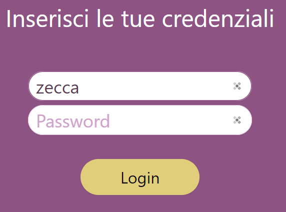
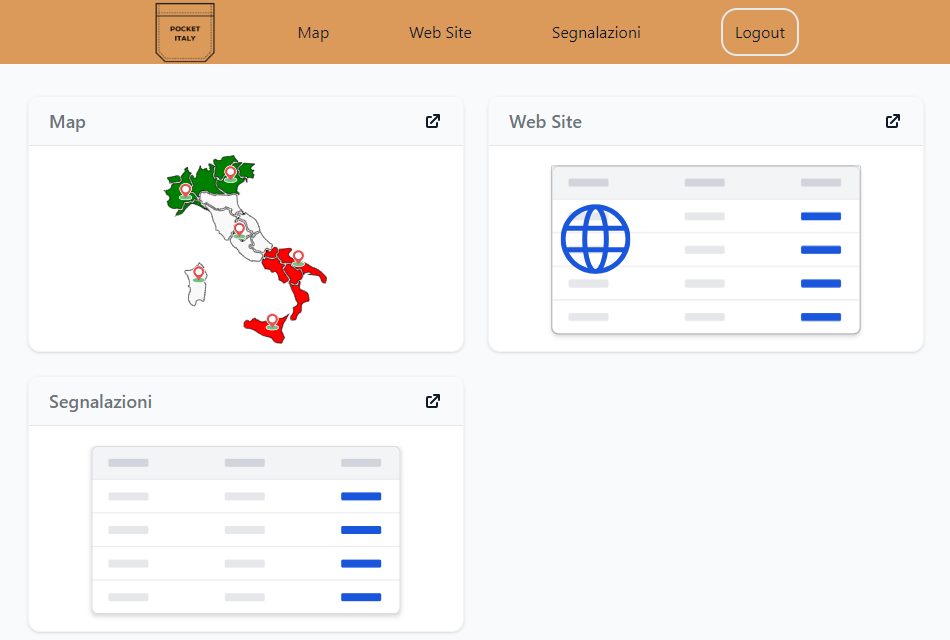
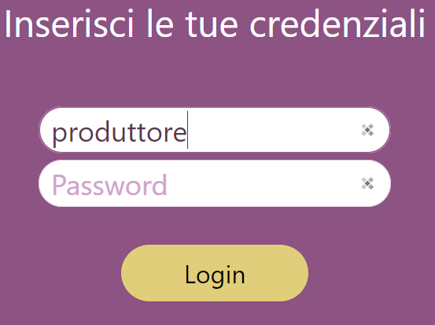
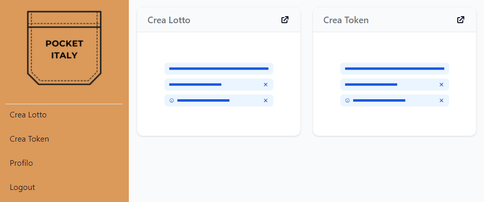
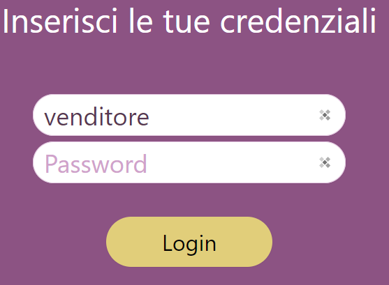
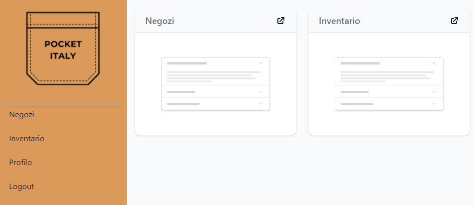
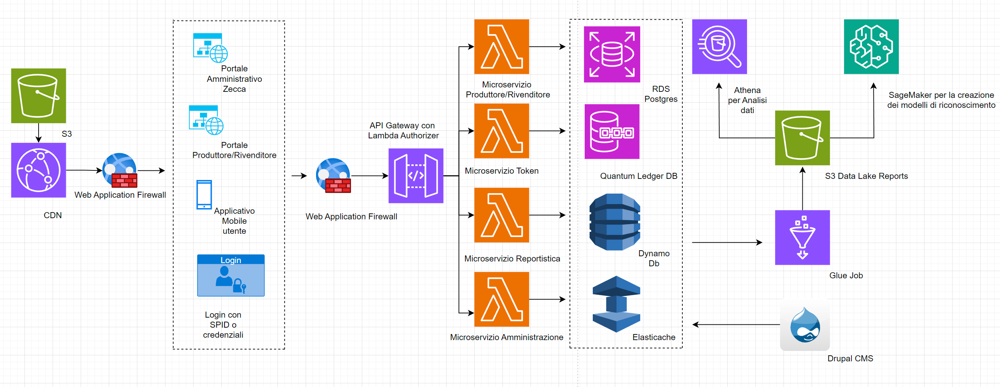
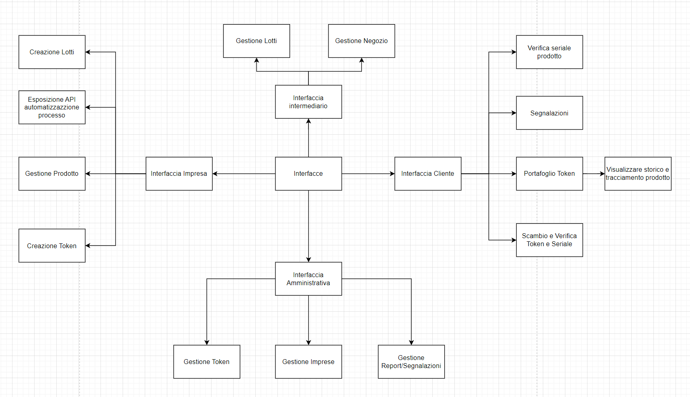
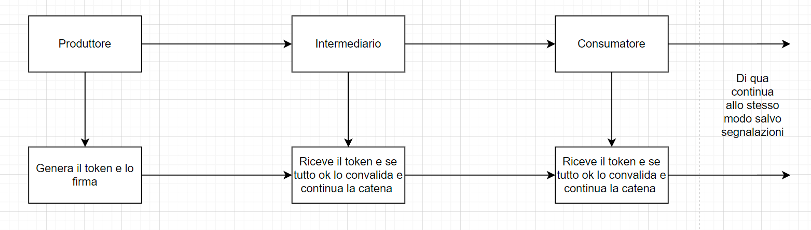
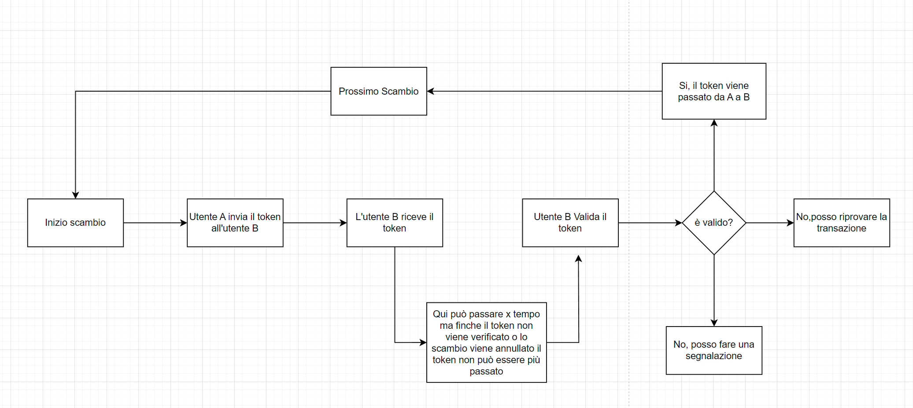

# PocketItaly

## Descrizione Progetto
Pocket Italy nasce con l’obbiettivo di tutelare il mercato della moda Made in Italy in Italia e all’estero, andando a fornire degli strumenti utili per tutti gli attori che sono coinvolti nel mondo della contraffazione: Utente finale, rivenditore e/o produttore e la Zecca dello Stato.

L'utente attraverso la nostra applicazione scaricata sul suo smartphone, è in grado di identificare se un articolo è certificato Made in Italy o meno, attraverso un processo di scansione fisica o digitale dell’articolo. Inoltre l'utente può inviare una segnalazione alla Zecca dello Stato per eventuali acquisti effettuati prima di usare l’applicazione.

Il prodotto acquistato dall’utente finale non è solo fisico ma anche digitale. Infatti il produttore è autorizzato a creare un token che certifichi in modo univoco l’articolo creato e permetta di visualizzare lo storico della proprietà del bene. Questo meccanismo permette di tutelare tutti i mercati. (B2B, B2C e C2C).

Ogni volta che un utente genera report(passivo) o invia una segnalazione(attivo) va a confluire all’interno di un portale messo a disposizione alla Zecca dello Stato, in modo tale da monitorare le possibili contraffazioni e in tal caso intervenire in maniera diretta per vie legali. 

Infine, l’applicazione prevede una parte di istruzione dove l’utente può informarsi sulle ultime notizie sul tema della contraffazione e apprendere delle nozioni riguardo tale argomento, oltre alla possibibilità di riscattare dei codici sconto da usare nei negozi affliati dopo N scansioni, dove N è incognito agli utenti

## Figma app mobile 
https://www.figma.com/file/5zGqQkbv1qP0dlcD99nf6j/Pocket-Italy-App?type=design&t=XzP8tLn4shKsSsmi-6

## Figma portale web
https://www.figma.com/file/RDT5TnesSqZ2rihng3ypCT/Pocket-Italy-Portal?type=design&t=XzP8tLn4shKsSsmi-6

## Sorgenti Backend
https://github.com/BacaroTech/PocketItaly-Server

## Demo Portale
https://pocket-italy.github.io/home-login

abbiamo creato una demo per visualizzare cosa può vedere i tre tipi di utenti

Utenti:
- zecca
- produttore
- venditore

Tutti i dati sono moccati in assets file.
Per simulare la login è sufficiente inserire nel campo della email un dei seguenti campi e cliccare su login

### utente: zecca




### utente: produttore




### utente: venditore





# Sorgenti
Di seguito come installare e avviare i tre sorgenti

## Mobile

```
cd PocketMobile
```
Da fare solo una volta comune
```
npm install
```
### Android
Da fare solo una volta
creare il file local.properties al seguente path:

```
PocketMobile/android/local.properties
```
con il seguente parametro

```
sdk.dir=PATH_ANDROID_SDK
## Esempio
sdk.dir=C\:\\Users\\username\\AppData\\Local\\Android\\Sdk
```

Avvio
```
npm run android
```
Se si ha uno smartphone collegato

### IOS

Da fare solo una volta
```
cd ios
pod install
```
Avvio con il simulatore 
```
npm run ios -- --simulator="iPhone 15"
```

### Requisiti Per Android
- Android SDK
- ADB

<b>Android SDK</b>

Per installare SDK Tools di android ci sono due strade:
1) Installare android studio
- scaricare android studio: https://developer.android.com/studio
- installare l'IDE
- cercare l'SDK dell'IDE al path C\:\\Users\\username\\AppData\\Local\\Android\\Sdk

2) Installare SDK
- scaricare https://developer.android.com/tools
- impostare le variabili

<b>ADB Android Debug Bridge</b>

https://developer.android.com/tools/adb

### Requisiti Per IOS
- xcode
- RubyGem
- Cocoapods

<b>Installare X Code</b>
https://apps.apple.com/it/app/xcode/id497799835?mt=12

<b>Installare RubyGem</b>

Documentazione https://guides.rubygems.org/rubygems-basics/

Passaggi
```
brew install ruby
echo ‘export PATH=”/usr/local/opt/ruby/bin:$PATH”‘ ＞＞ ~/.bash_profile
```

<b>Cocoapods</b>

Documentazione https://cocoapods.org/

Passaggi
```
sudo gem install cocoapods
```


## Portale
Il portale è un applicativo angular

```
cd pocket-portal
```

Da fare solo una volta

```
npm install
```

Avvio in locale

```
npm start
```

# Architettura

Per il nostro progetto abbiamo scelto un'architettura che ottimizza i tempi di conseguenza abbiamo
deciso di utilizzare un server Node.js accoppiato a un database PostgreSQL.

Questa è l'architettura semplificata che abbiamo ideato nell'ipotetico caso il progetto dovesse 
effettivamente realizzarsi.

## Panoramica dell'Architettura basata su AWS



Questa architettura sfrutta AWS per garantire affidabilità e robustezza, consentendo una gestione efficace anche durante picchi imprevisti di traffico. Semplifica il processo di replica dei sistemi in più zone, accelerando il recupero in scenari di disastro rispetto ai sistemi on-premise.

## Componenti dell'Applicazione

### Portali Web
- **Distribuzione CDN**: Due portali web distribuiti attraverso una Content Delivery Network per ottimizzare la velocità e la disponibilità e applicazione distribuita negli store.

## Sicurezza

- **Web Application Firewall (WAF)**: Protegge le distribuzioni dai comuni attacchi web.
- **Autenticazione Multi-Fattore (MFA)**: Richiesta obbligatoria per aumentare la sicurezza degli account utente.
- **SPID**: Integrazione con SPID per facilitare un accesso sicuro, sfruttando una piattaforma già utilizzata da circa 37 milioni di persone.

## Gestione delle API e Logica

- **API Gateway**: Distribuisce le richieste alle funzioni AWS Lambda, che possono essere eseguite in parallelo per gestire elevati volumi di traffico.
- **Lambda per l'Autorizzazione**: Gestisce l'autorizzazione a livello di API Gateway. Le autorizzazioni sono salvate in cache per accelerare l'accesso alle richieste successive.
- **Lambda**: Lambda per implementazione dei vari microservizi.

## Storage e Database

- **DynamoDB**: Archivia i dati delle transazioni tra i microservizi.
- **PostgreSQL**: Database relazionale per i dati applicativi, offrendo controllo e affidabilità. La scalabilità orizzontale è garantita da repliche di lettura.
- **Quantum Ledger Database (QLDB)**: Utilizzato per archiviare in modo sicuro e immutabile i dati delle transazioni dei token.
- **Elasticache**: Utilizzato per il caching dell'autorizzazione e per ottimizzare la velocità dell'applicazione.

## Gestione dei Contenuti

- **Drupal**: Gestisce la creazione di contenuti per la sezione news e sensibilizzazione, facilitando la pubblicazione di articoli e altri contenuti attraverso l'applicazione
              ed evitando la creazione di un portale dedicato all'aggiunta di contenuto.

## Analisi dei Dati

- **ETL e S3 Bucket**: I dati sono aggregati e trasformati attraverso processi ETL e salvati in un bucket S3 dedicato.
- **Athena e SageMaker**: Athena permette di interrogare i dati nel bucket S3. SageMaker è utilizzato per creare e addestrare modelli di machine learning basati su questi dati.


# Interfacce Esposte



1. **Interfaccia Impresa**:
   - Gestisce prodotti e lotti.
   - Crea token per i prodotti.
2. **Interfaccia Intermediario**:
   - Gestisce la distribuzione dei prodotti.
   - Valida i token e gestisce la negoziazione.
3. **Interfaccia Cliente**:
   - Permette ai clienti di verificare i seriali dei prodotti e generare i report di conseguenza.
   - Gestisce il portafoglio di token e le segnalazioni.
4. **Interfaccia Amministrativa**:
   - Gestisce le imprese e i report di segnalazione.

# Funzionamento Token



## Flusso di distribuzione
1. **Produttore**:
   - Genera e firma il token, garantendo l'origine autentica e l'integrità del prodotto.
2. **Intermediario**:
   - Riceve il token dal produttore.
   - Valida il token per confermarne l'autenticità e continua la catena di distribuzione.
3. **Consumatore**:
   - Riceve il token dall'intermediario.
   - Valida il token e, se confermato, accetta il prodotto.

## Azioni e Risoluzioni
- **Validazione**: Ogni partecipante deve validare il token prima di passarlo al successivo.
- **Segnalazioni**: Se il token non è valido, possono essere effettuate segnalazioni per ulteriori indagini.




## Flusso di Validazione
1. **Inizio Scambio**:
   - Utente A inizia l'invio del token a Utente B.
2. **Ricezione e Validazione**:
   - Utente B riceve il token.
   - Utente B valida il token per verificarne l'autenticità.
3. **Risoluzione**:
   - **Token Valido**: Se il token è valido, il processo procede.
   - **Token Non Valido**: Utente B ha opzioni per riprovare la transazione o fare una segnalazione.

## Azioni
- **Prossimo Scambio**: Se il token è valido, procede al prossimo passo.
- **Riprova Transazione**: Se il token non è valido, può essere riprovata la transazione.
- **Segnalazione**: In caso di invalidità del token, può essere fatta una segnalazione.
